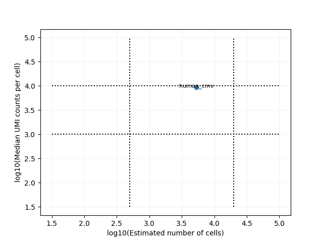
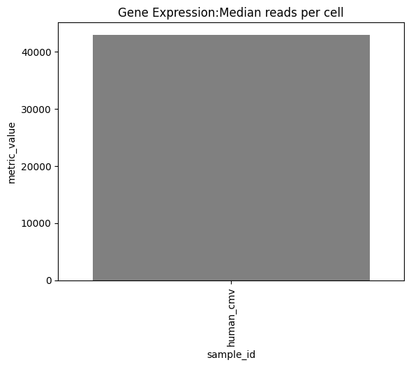
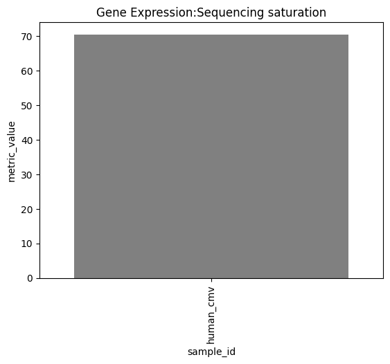
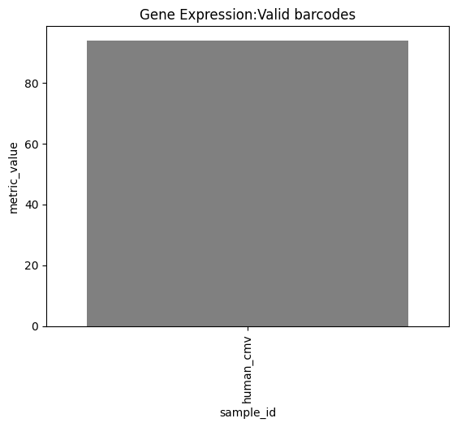
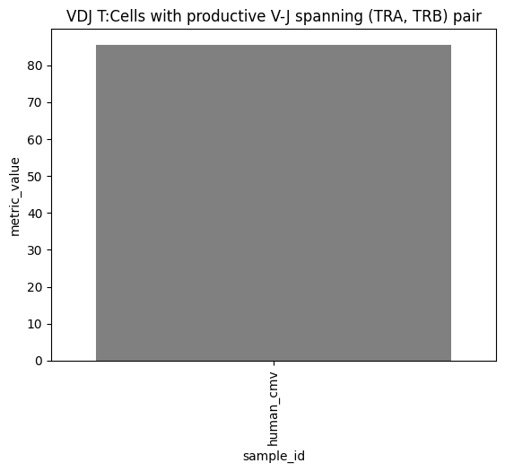
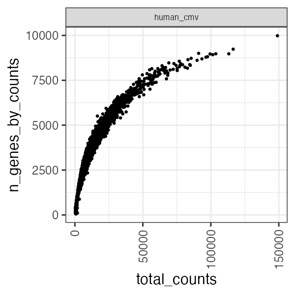
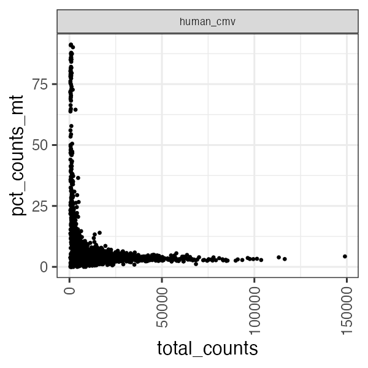
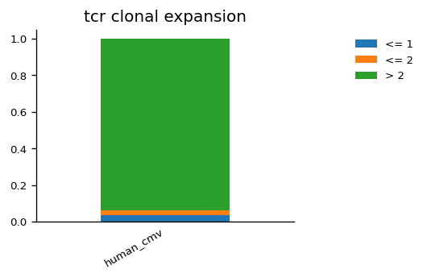
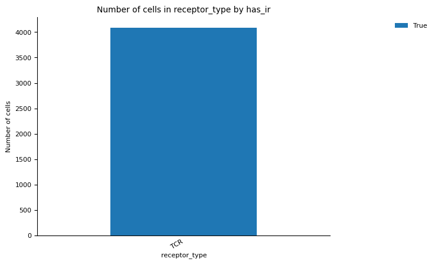
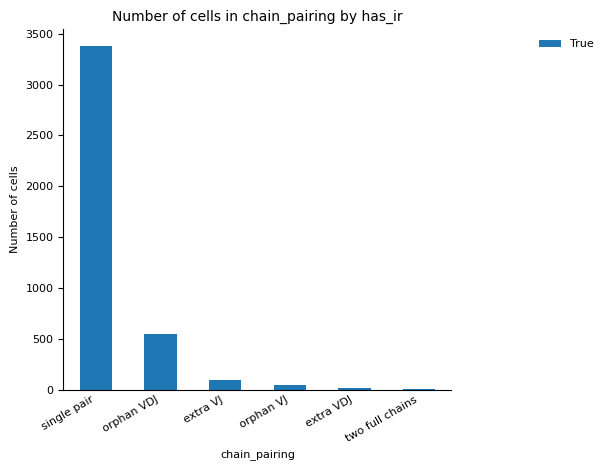

# Tutorial

Analyzing scRNA-seq and scTCR-seq Data with Panpipes
===================

## Introduction

This tutorial guides you through the process of analyzing single-cell RNA sequencing (scRNA-seq) and single-cell T-cell receptor sequencing (scTCR-seq) data using Panpipes.
While similar to the multimodal CITE-seq tutorial, this guide differs in two major points – it's much easier to follow and it focuses on single-cell transcriptomics and immunomics (AIRR – Adaptive Immune Receptor Repertoire) analysis.

## Before you start

### Running pipelines

- **Re-running analyses:** if you need to re-run the pipeline from scratch, ensure you remove any existing `1_ingest` directories to prevent conflicts.

- **Error handling:** while Panpipes strives to provide clear error messages, some issues may still arise. If you encounter unclear errors, please report them by opening an issue on our GitHub repository.

- **File organization:** for convenience, all necessary files are provided in the section below. Ensure that your file and folder structures mirror the setup described to avoid potential issues.

## Setup

### Install panpipes

There are several ways you can install `panpipes`, and the best options depends on your existing environment.

#### Python venv - if you have R already installed

If you already have R installed on your machine, we highly recommend minimize the usage of heavy package managers such as conda, and opt out for more traditional Python methods.

To create a reproducible environment you can create a Python virtual environment in your project folder, and install packages there. It allows you to fully isolate your local environment and not contaminate or break outside projects.

To create a Python virtual environment, do the following:

1. Open the console and navigate to your project folder.

2. Run the code to create the environment `python3 -m venv --prompt=panpipes .venv/`.

3. Activate the environment via running `source .venv/bin/activate`.

4. Now, if you run the package installation via `pip install` in console, `pip` will install packages to your local environment `.venv`.

You can even maintain multiple Python virtual environments side by side for different projects.

To install R dependencies for `panpipes`, run `panpipes install_r_dependencies`.

#### Other installation options

For Apple Silicone instructions, more magic with R and conda guide follow this tutorial - <https://panpipes-pipelines.readthedocs.io/en/latest/install.html>

However, in our experience, separate installations of Python and R worked the best – you install a system-wide R, and follow the steps from the previous section on `panpipes` installation in a virtual environment.

### Check the panpipes installation

If everything is setup correctly, this command should work without any errors:

```bash
panpipes --help
```

### Download the dataset

Create a folder named `data` in your project folder `project`. Inside the data folder, create the following subfolders:

```
data  
└── outs  
    ├── multi  
    │   ├── count  
    │   └── vdj_t  
    └── per_sample_outs  
        └── human_cmv  
            ├── count  
            └── vdj_t  

```

Yes, that’s quite a few folders, but don’t worry. We will provide ways to double-check whether the files are in the correct locations. For example, if you run `ls data/outs/multi/count/`, you should see the `raw_feature_bc_matrix` folder, `feature_reference.csv`, and `raw_feature_bc_matrix.h5`.

For this tutorial, we will use the 10XGenomics data on CMV and human T-cells from this [link](https://www.10xgenomics.com/datasets/integrated-gex-totalseqc-and-tcr-analysis-of-connect-generated-library-from-5k-cmv-t-cells-2-standard).

Here is the list of files you need to download from the link above and where you should put them.

1. From the tab "Output and supplemental files", choose the "Raw" subsection from the "Raw output" section. Download the `Gene Expression - Feature / cell matrix (raw)` file. Extact it to `data/outs/multi/count` and rename the extracted folder to `raw_feature_bc_matrix`.

2. From the same page, download `Gene Expression - Feature / cell matrix HDF5 (raw)` and extract the file to `data/outs/multi/count/raw_feature_bc_matrix.h5`. Note that this is a path to the file, i.e., you don't need to create a folder named `raw_feature_bc_matrix.h5`.

3. Download `VDJ TCR - All contig annotations (CSV)` and copy it to `data/outs/multi/vdj_t/all_contig_annotations.csv`.

4. Go to the section "Per sample outputs", subsection "Single channel", and download the file `Gene Expression - Feature Reference`. You need to copy it to two places: `data/outs/multi/count/feature_reference.csv` and `data/outs/per_sample_outs/human_cmv/count/feature_reference.csv`.

5. Download `Summary CSV` and copy it to `data/outs/per_sample_outs/metrics_summary.csv`.

6. Download `Gene Expression - Feature / cell matrix (per-sample)` and extract the folder to `data/outs/per_sample_outs/human_cmv/count/` with the name `sample_filtered_feature_bc_matrix`.

7. Download `Gene Expression - Feature / cell matrix HDF5 (per-sample)` and copy it to `data/outs/per_sample_outs/human_cmv/count/sample_filtered_feature_bc_matrix.h5`.

8. And finally, download `Gene Expression - Sample barcodes` and copy it to `data/outs/per_sample_outs/human_cmv/count/sample_filtered_barcodes.csv`.

This is how it should look like in the end:

```
data/  
└── outs/  
    ├── multi/  
    │   ├── count/  
    │   │   ├── raw_feature_bc_matrix/  
    │   │   ├── feature_reference.csv  
    │   │   └── raw_feature_bc_matrix.h5  
    │   └── vdj_t/  
    │       └── all_contig_annotations.csv  
    └── per_sample_outs/  
        ├── human_cmv/  
        │   ├── count/  
        │   │   ├── sample_filtered_feature_bc_matrix/  
        │   │   ├── feature_reference.csv  
        │   │   ├── sample_filtered_barcodes.csv  
        │   │   └── sample_filtered_feature_bc_matrix.h5  
        │   └── vdj_t/  
        │       └── filtered_contig_annotations.csv  
        └── metrics_summary.csv  
```

### Submission, pipeline config, and gene files

For your convenience, we prepared necessary files for running `panpipes` with the dataset you just downloaded.

#### Submissiong file

Download link: [submission file](./files/short_vdj_submission.tsv)

First, the submission file with dataset information. You need to change the file paths in the file to your project file path. Important note: you must provide full file paths.
I.e., `~/Projects/project-name/data/out/filename.csv` wouldn't work, only `/Users/yourname/Projects/project-name/data/out/filename.csv` would work.

Besides the first column, “sample_id”, the order in which the columns are provided is not fixed, but the column names are fixed! Failing to specify the column names will result in omission of the modality from the analysis and early stopping of the pipeline.

We find useful to generate the submission file with softwares like Numbers or Excel and save the output as a txt file to ensure that the file is properly formatted. For more examples please check our documentation on sample submission files.

Put the submission file to the top of your project:

```
project-name/
├── data/  
│   └── outs/...  
└── short_vdj_submission.tsv
```

### Pipeline configuration file

Download link: [pipeline.yml](./files/pipeline.yml)

Pipeline configuration files store all the input files and settings for analysis steps. We provide a ready-to-go pipeline configuration file. Download it and put it inside the `1_ingest` folder:

```
project-name/
├── 1_ingest/  
│   └── pipeline.yml
├── data/  
│   └── outs/...  
└── short_vdj_submission.tsv
```

### List of genes for quality control

Download link: [qc_genelist_1.0.csv](./files/qc_genelist_1.0.csv)

`Panpipes` already comes with this resource, but for the tutorial purposes we provide a separate link to this file. Download it and put it in the `1_ingest` folder:

```
project-name/
├── 1_ingest/  
│   ├── pipeline.yml
│   └── qc_genelist_1.0.csv
├── data/  
│   └── outs/...  
└── short_vdj_submission.tsv
```

### Backup

In case of mistakes, we recommend to create a backup folder, from which the downloaded files could be restored:

```
project-name/
├── 1_ingest/  
│   ├── pipeline.yml
│   └── qc_genelist_1.0.csv
├── backup/
│   ├── pipeline.yml
│   └── qc_genelist_1.0.csv
├── data/  
│   └── outs/...  
└── short_vdj_submission.tsv
```

## Analysis

### Run

To run `panpipes`, you need to create a folder `1_ingest` on the top of the project folder, if you haven't already:

```
project-name/
├── 1_ingest/  
│   ├── pipeline.yml
│   └── qc_genelist_1.0.csv
├── data/  
│   └── outs/...  
└── short_vdj_submission.tsv
```

Open the console and do the following:

1. Navigate to the project folder.

2. Activate the environment, e.g., execute `source .venv/bin/activate` if you went with the Python environment.

3. Navigate to `1_ingest` folder: `cd 1_ingest`.

4. If you want to generate the config file and change it, or replace it with ours from the section above, you need to execute `panpipes ingest config`. But make sure to double-check that relevant `pipeline.yml` and `qc_genelist_1.0.csv` are in the correct place.

5. Now `panpipes` is ready for running the analysis. Execute `panpipes ingest make full --local` if you are working on a local machine; execute `panpipes ingest make full` if you are working on a cluster.

6. The pipeline will write logs to the console output and to the logs files in the `1_ingest`. If everything went smoothly, you will see something like this in the console:

```
2023-11-27 10:07:10,498 INFO main task - Completed Task = 'pipeline_ingest.full' 
2023-11-27 10:07:10,499 INFO main experiment - job finished in 978 seconds at Mon Nov 27 10:07:10 2023 -- 27.26 12.18  0.14  0.52 -- 85d537bd-19b2-41cd-8134-5d615c1342e5
```

7. If something went bad, you will see error messages, that you could analyze, ask ChatGPT or any other LLM-assistant about it, or create an issue in the repository. Detailed logs are stored in `1_ingest/logs/*.log`.

If everything is OK, you will see plots in `1_ingest/rna`, `1_ingest/rep`, and `1_ingest/tenx_metrics`.

Let's go over several of them.

### 10x Genomics Metrics

Below are automatically generated summary plots from the 10x Genomics pipeline. They help assess overall data quality and ensure that the library prep and sequencing worked as expected:

- **Estimated Number of Cells**  
  Shows how many cells were captured in the dataset.  
  *Why it matters:* If this number is much lower than your expected cell count, you might have lost cells or had poor capture efficiency.

  

- **Median Reads per Cell**
  Indicates sequencing depth per cell.  
  *Why it matters:* Higher depth typically reveals more genes per cell. If too low, you might miss important transcripts.

  

- **Sequencing Saturation**  
  Shows whether you’ve sufficiently captured most transcripts in each cell.  
  *Why it matters:* High saturation means further sequencing may not add much; low saturation suggests you might need deeper sequencing.

  

- **Valid Barcodes** / Valid UMIs**  
  Proportion of barcodes/UMIs successfully identified.  
  *Why it matters:* Low percentages indicate potential technical issues with library prep or sequencing.

  
  

- **VDJ T-Cells with Productive TRA/TRB Contigs**  
  The fraction or count of T cells that have valid α or β T-cell receptor chains.  
  *Why it matters:* A higher number means more cells can be used for TCR-specific analyses, such as clonal expansion or antigen specificity.

  

### RNA QC Plots

These plots focus on standard single-cell RNA-seq quality control metrics, helping you decide which cells are high-quality for downstream analysis.

- **nUMI vs. nGene**  
  Shows how many unique transcripts (UMIs) each cell has versus how many genes were detected.  
  *Why it matters:* Cells with extremely low gene counts might be empty droplets; extremely high counts might be doublets.

  

- **nUMI vs. % Mitochondrial**  
  Plots total UMI counts against the fraction of reads mapping to mitochondrial genes.  
  *Why it matters:* Cells with high mitochondrial fraction (>10–15%) are often stressed or dying and may need to be excluded.

  

### TCR Repertoire Plots

These plots give insight into the diversity and clonal structure of T-cell receptors (TCR), which is key for immunology-focused projects.

- **Bar Plot of Clonal Expansion**  
  Displays TCR clone sizes (how many cells share the same TCR).  
  *Why it matters:* Large bars indicate highly expanded clones, potentially responding to a specific antigen.

  

- **Group Abundance by Receptor Type / Subtype**  
  Shows how different TCR receptor types (TRA/TRB) or subtypes are distributed across samples.  
  *Why it matters:* Highlights whether certain receptor chains or subtypes predominate in your dataset.

  

  

### How to re-run the analysis

If something went bad, it is crucial that you re-run the whole analysis from scratch. You can't (!) continue from a failed step – you need to fix the step and start the analysis from zero. For that, please see the full code to execute in the following section.

#### Re-running the analysis without re-installation of panpipes

Useful when you tweak something in your data.

```
# if you are in the 1_ingest folder; otherwise skip this step
cd ..

rm -r 1_ingest
mkdir 1_ingest
cd 1_ingest
panpipes ingest config
cp ../backup/* ./
panpipes ingest make full --local
```

#### Re-running the analysis with re-installation of panpipes

Use it when you work on `panpipes` locally and change something in the source code. We assumer you are in the `1_ingest` folder.

```
cd .. && pip install -e .
rm -r ./1_ingest
mkdir 1_ingest
cd 1_ingest
panpipes ingest config
cp ../backup/* ./
panpipes ingest make full --local
```

Mind the `pip install -e .`. It installs `panpipes` locally and doesn't require to changing the version of the package. However, here we assume that you work with the data analysis from the same folder, where the source code of `panpipes` is stored, i.e.,:

```
panpipes/
├── 1_ingest/  
│   ├── pipeline.yml
│   └── qc_genelist_1.0.csv
├── data/  
│   └── outs/...  
├── short_vdj_submission.tsv
├── docs # docs for panpipes
├── panpipes # source code
├── tests
└── ...
```

## Contact and troubleshooting

For `panpipes` issues please use <https://github.com/DendrouLab/panpipes>

For issues with tutorials please use <https://github.com/DendrouLab/panpipes-tutorials/issues>

The tutorial is prepared by [Vadim Nazarov](https://github.com/vadimnazarov). Please feel free to reach out with scTCR/BCR-seq questions and if there are some issues with, well, GitHub issues.
