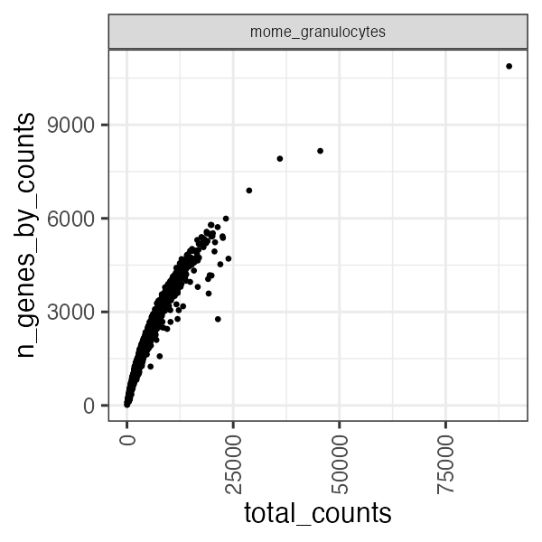
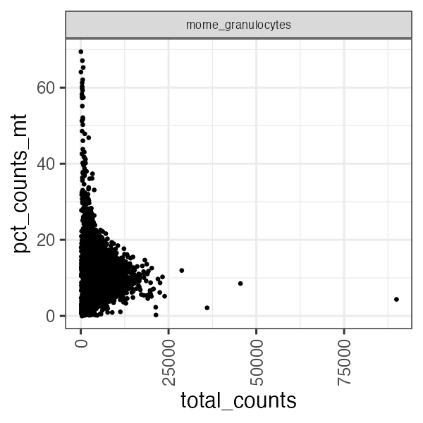
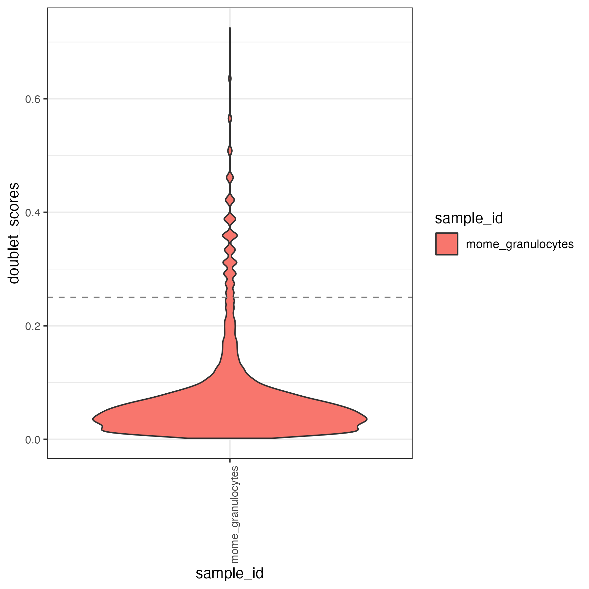
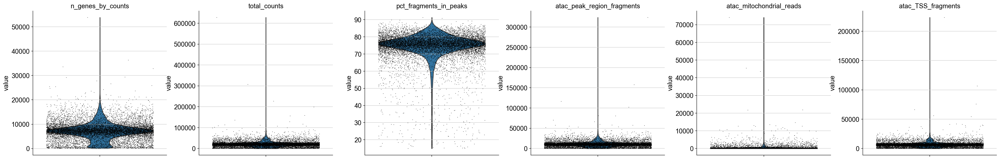
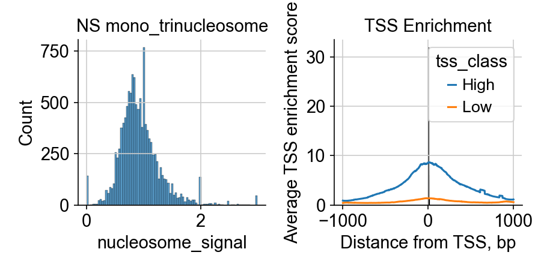
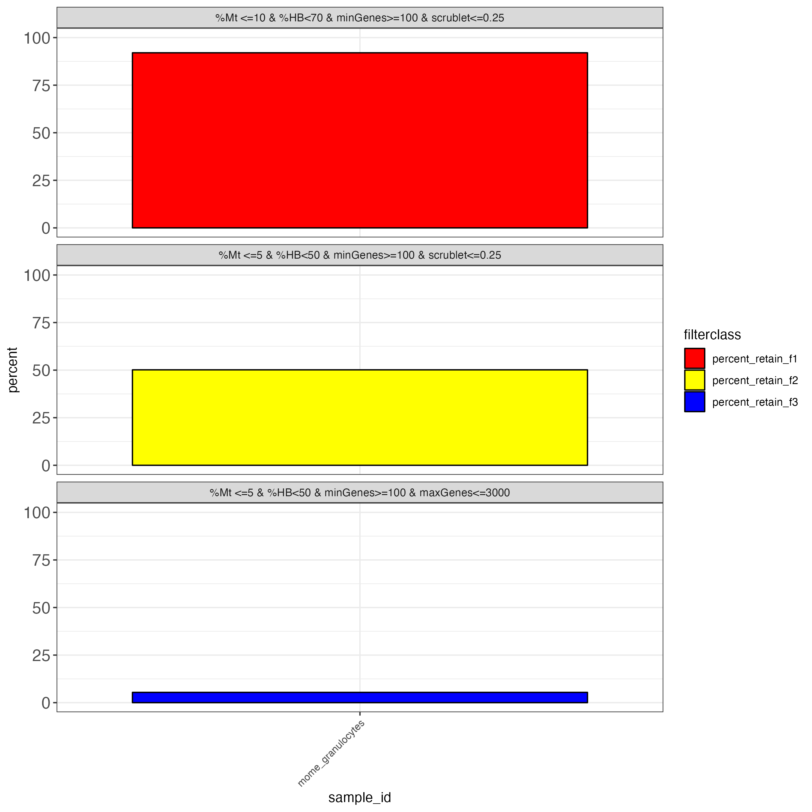

Ingesting multiome datasets from cellranger arc outputs 
===================

Panpipes can read files from different cellranger outputs. Here we will showcase the example of a multiome dataset from the 10x website. Download the files from the [10x website](https://www.10xgenomics.com/resources/datasets/pbmc-from-a-healthy-donor-granulocytes-removed-through-cell-sorting-10-k-1-standard-2-0-0)

For this tutorial, we have downloaded the files in a folder `10Xmultiome_granulocytes` and we generated softlinks to simulate the filenames that are the standard output of the [cellranger arc pipeline](https://support.10xgenomics.com/single-cell-multiome-atac-gex/software/pipelines/latest/output/overview). 

These filenames are the expected inputs to `panpipes`. 

Create your ingestion folder and organize the input data.

```
mkdir momedocs && cd $_
mkdir data.dir

# Here we show how the input data is organized

tree data.dir
data.dir
├── atac_fragments.tsv.gz -> ../10Xmultiome_granulocytes/atac_fragments.tsv.gz
├── atac_fragments.tsv.gz.tbi -> ../10Xmultiome_granulocytes/atac_fragments.tsv.gz.tbi
├── atac_peak_annotation.tsv -> ../10Xmultiome_granulocytes/atac_peak_annotation.tsv
├── filtered_feature_bc_matrix.h5 -> ../10Xmultiome_granulocytes/filtered_feature_bc_matrix.h5
├── pbmc_granulocyte_sorted_10k_atac_fragments.tsv.gz -> ../10Xmultiome_granulocytes/pbmc_granulocyte_sorted_10k_atac_fragments.tsv.gz
├── pbmc_granulocyte_sorted_10k_atac_fragments.tsv.gz.tbi -> ../10Xmultiome_granulocytes/pbmc_granulocyte_sorted_10k_atac_fragments.tsv.gz.tbi
├── pbmc_granulocyte_sorted_10k_atac_peak_annotation.tsv -> ../10Xmultiome_granulocytes/pbmc_granulocyte_sorted_10k_atac_peak_annotation.tsv
├── pbmc_granulocyte_sorted_10k_filtered_feature_bc_matrix.h5 -> ../10Xmultiome_granulocytes/pbmc_granulocyte_sorted_10k_filtered_feature_bc_matrix.h5
├── pbmc_granulocyte_sorted_10k_per_barcode_metrics.csv -> ../10Xmultiome_granulocytes/pbmc_granulocyte_sorted_10k_per_barcode_metrics.csv
├── pbmc_granulocyte_sorted_10k_summary.csv
└── summary.csv -> pbmc_granulocyte_sorted_10k_summary.csv
```

We created a sample submission file which will instruct `panpipes` on how to find each modality's path. Download this submission file [here](../ingesting_multiome/multiomecaf.txt).
Besides the first column, "sample_id",  the order in which the columns are provided is not fixed, but the names are! For more examples please check the [documentation](https://panpipes-pipelines.readthedocs.io/en/latest/usage/setup_for_qc_mm.html#panpipes-sample-submission-file)

| sample_id         | atac_path                              | atac_filetype | fragments_file                 | per_barcode_metrics_file                                     | peak_annotation_file              | tissue       | diagnosis | rna_path                               | rna_filetype |
| ----------------- | -------------------------------------- | ------------- | ------------------------------ | ------------------------------------------------------------ | --------------------------------- | ------------ | --------- | -------------------------------------- | ------------ |
| mome_granulocytes | data.dir/filtered_feature_bc_matrix.h5 | 10X_h5        | data.dir/atac_fragments.tsv.gz | data.dir/pbmc_granulocyte_sorted_10k_per_barcode_metrics.csv | data.dir/atac_peak_annotation.tsv | granulocytes | healthy   | data.dir/filtered_feature_bc_matrix.h5 | 10X_h5       |

									
In this folder, activate the environment in which you have installed `panpipes` and configure the `ingest` workflow.

`panpipes ingest config`

Modify the config file to read in the sample submission file exemplified. You can find the preconfigured `pipeline.yml` file [here](../ingesting_multiome/pipeline.yml). 

Please remember to do the necessary changes in this file to ensure it will run on your computer, and specify:
- the environment in which you're running panpipes, if applicable.
- the path to the custom_genes_file that we use to run scanpy.score.genes (we provide an example file in the panpipes' resources folder)

Now, run the full panpipes ingestion workflow with:

` panpipes ingest make full`

The pipeline will produce a series of outputs, let's inspect a few of them.


```
tree ../momedocs -L 1

├── 10Xmultiome_granulocytes
├── 10x_metrics.csv
├── data.dir
├── figures
├── logs
├── mome_cell_metadata.tsv
├── mome_threshold_filter.tsv
├── mome_threshold_filter_explained.tsv
├── mome_unfilt.h5mu
├── multiomecaf.txt
├── pipeline.log
├── pipeline.yml
├── raw_mome.tar.gz
├── scrublet
└── tmp

```

| Output file                         | type file | info                                                                                                                                                         |
| ----------------------------------- | --------- | ------------------------------------------------------------------------------------------------------------------------------------------------------------ |
| 10Xmultiome_granulocytes            | directory | the folder we downloaded                                                                                                                                     |
| 10x_metrics.csv                     | text file | output file from parsing the cellranger summary_metrics file                                                                                                 |
| data.dir                            | directory | the folder with input files we organized                                                                                                                     |
| figures                             | directory | folder storing plots generated throughout the ingest workflow                                                                                                |
| logs                                | directory | folder storing logs generated throughout the ingest workflow                                                                                                 |
| mome_cell_metadata.tsv              | text file | the cell metadata of the experiment (the .obs slot of the mudata object) saved as a tsv file                                                                 |
| mome_threshold_filter.tsv           | text file | summary file showing percentage of cells remaining for commonly used QC thresholds on genes and cells. This filtering is not applied in the ingest workflow. |
| mome_threshold_filter_explained.tsv | text file | file containing the thresholds used to produce the previous file                                                                                             |
| mome_unfilt.h5mu                    | h5mu      | the mudata generated from the input files                                                                                                                    |
| multiomecaf.txt                     | text file | input sample submission file                                                                                                                                 |
| pipeline.log                        | log       | pipeline log file, stores all the info on the commands run                                                                                                   |
| pipeline.yml                        | yaml      | input yaml file                                                                                                                                              |
| scrublet                            | directory | directory storing the scrublet analysis results                                                                                                              |
| tmp                                 | directory | directory storing temporary h5mu files (one for each sample in the submission file)                                                                          |
|                                     |           |                                                                                                                                                              |


Let's take a look at the figures folder to demonstrate how we have used the workflow to run some analyses on the newly generated mudata.

`panpipes ingest` workflow computes qc metrics for each modality given as input. For a multiome sample it may be useful to check RNA metrics such as number of genes detected in cells, percentage of mitochondrial reads per cell and library size.


<div>
	
	
	
</div>

Some atac useful metrics are also plotted, including percentage fragments in peaks, mitochondrial reads mapping to the open chromatin regions, tss enrichment.







To aid with the filtering of the data, we also produce outputs that simulate common filtering scenarios, the height of the bar shows the percentage of cells retained if the threshold is applied. 



Users can also inspect the unfiltered mudata generated file by reading it in a python session:

```
import muon as mu
mu.read("mome_unfilt.h5mu")
```

We have demonstrated how to run the `ingest` workflow on multiome data. Filtering of cells and genes is not applied in the `ingest` workflow but in the `preprocess`. Inspecting these output should help the user to choose appropriate filters for their data!

