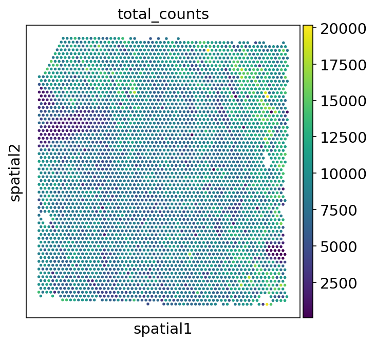
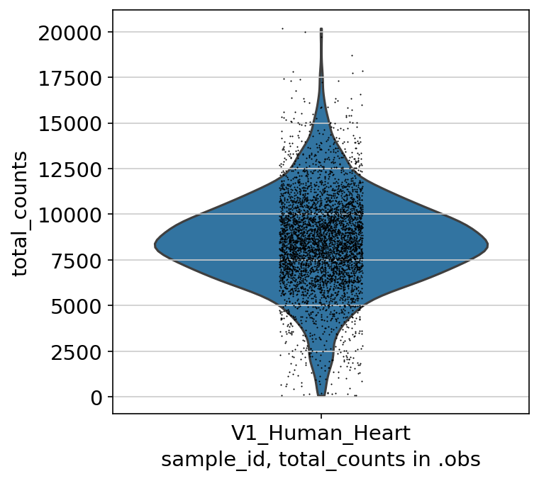

# Ingesting 10X Visium data with Panpipes

Let's run through an example of reading `10X Visium` data into `MuData` objects and computing QC metrics using `Panpipes`. The [workflow](https://github.com/DendrouLab/panpipes/blob/main/docs/workflows/ingest_spatial.md) describes the steps run by the pipeline in detail. 

For all the tutorials, we will append the `--local` command which ensures that the pipeline runs on the computing node you're currently on, namely your local machine or an interactive session on a computing node on a cluster.

### Create directories and download data

Let's create a main `spatial` directory and in that directory, the directories `ingestion` and `data`.

```
mkdir spatial
cd spatial
mkdir ingestion ingestion/data
```

In this tutorial, we will use two 10X Visium datasets, [a Human Lymph node dataset](https://support.10xgenomics.com/spatial-gene-expression/datasets/1.0.0/V1_Human_Lymph_Node) and
[a Human Heart dataset.](https://www.10xgenomics.com/resources/datasets/human-heart-1-standard-1-0-0)
To download the two datasets into the `data` folder, you can use the following commands: 

```
cd ingestion/data 
mkdir V1_Human_Heart V1_Human_Lymph_Node

# download human heart count matrix and spatial info 
cd V1_Human_Heart
curl -O https://cf.10xgenomics.com/samples/spatial-exp/1.0.0/V1_Human_Heart/V1_Human_Heart_filtered_feature_bc_matrix.h5
curl -O https://cf.10xgenomics.com/samples/spatial-exp/1.0.0/V1_Human_Heart/V1_Human_Heart_spatial.tar.gz
tar -xf V1_Human_Heart_spatial.tar.gz

# download human lymph node count matrix and spatial info 
cd ../V1_Human_Lymph_Node
curl -O https://cf.10xgenomics.com/samples/spatial-exp/1.0.0/V1_Human_Lymph_Node/V1_Human_Lymph_Node_filtered_feature_bc_matrix.h5
curl -O https://cf.10xgenomics.com/samples/spatial-exp/1.0.0/V1_Human_Lymph_Node/V1_Human_Lymph_Node_spatial.tar.gz
tar -xf V1_Human_Lymph_Node_spatial.tar.gz
```


Inside the `ingestion` directory, you should now have a directory with all the data you downloaded:

```
data
├── V1_Human_Heart
│   ├── V1_Human_Heart_spatial.tar.gz
│   ├── V1_Human_Heart_filtered_feature_bc_matrix.h5
│   └── spatial
│       ├── aligned_fiducials.jpg
│       ├── detected_tissue_image.jpg
│       ├── scalefactors_json.json
│       ├── tissue_hires_image.png
│       ├── tissue_lowres_image.png
│       └── tissue_positions_list.csv
└── V1_Human_Lymph_Node
    ├── V1_Human_Lymph_Node_spatial.tar.gz
    ├── V1_Human_Lymph_Node_filtered_feature_bc_matrix.h5
    └── spatial
        ├── aligned_fiducials.jpg
        ├── detected_tissue_image.jpg
        ├── scalefactors_json.json
        ├── tissue_hires_image.png
        ├── tissue_lowres_image.png
        └── tissue_positions_list.csv
```

**Please note, that the data folder structure needs to be structured as expected by the [squidpy.read.visium](https://squidpy.readthedocs.io/en/stable/api/squidpy.read.visium.html) function.**


### Edit submission and yaml file 

In `spatial/ingestion`, create a submission file like the one we provide in the [tutorials](../../tutorials/ingesting_visium_data). For this tutorial, you can use the provided. 

In general, the spatial submission file expects the following columns: 

`sample_id` `spatial_path` `spatial_filetype` `spatial_counts` `spatial_metadata` `spatial_transformation` 

For `10X Visium datasets`, only the first four columns need to be specified. With `Panpipes` you can ingest multiple spatial slides by creating one line for each in the submission file. For each slide, one `MuData` will be created by the pipeline. Detailed information about the submission file is provided in the [usage guidelines](https://github.com/DendrouLab/panpipes/blob/main/docs/usage/setup_for_spatial_workflows.md)


Next, in `spatial/ingestion` call `panpipes qc_spatial config` (you potentially need to activate the conda environment with `conda activate pipeline_env` first!). This will generate a `pipeline.log` and a `pipeline.yml` file.

Modify the `pipeline.yml` or simply replace it with the one we provide in [tutorials](../../tutorials/ingesting_visium_data). Make sure to specify the correct path to the submission file. If you're using the [provided example yaml file](../../tutorials/ingesting_visium_data), you potentially need to add the path of the conda environment in the yaml. 

### Run Panpipes

In `spatial/ingestion`, run `panpipes qc_spatial make full --local` to ingest your `Visium` datasets.

In `spatial/ingestion` you should now have the following files: 

```
ingestion
├── data
├── figures
│   └── spatial
│       ├── spatial_spatial_total_counts.V1_Human_Heart.png
│       ├── spatial_spatial_total_counts.V1_Human_Lymph_Node.png
│       ├── violin_obs_total_counts_sample_id.V1_Human_Heart.png
│       ├── violin_obs_total_counts_sample_id.V1_Human_Lymph_Node.png
│       ├── violin_var_total_counts.V1_Human_Heart.png
│       └── violin_var_total_counts.V1_Human_Lymph_Node.png
├── logs
│	├── make_mudatas_V1_Human_Heart.log
│	├── qcplot.V1_Human_Lymph_Node.log
│	├── make_mudatas_V1_Human_Lymph_Node.log
│	├── spatialQC_V1_Human_Heart.log
│	└── qcplot.V1_Human_Heart.log  
├── qc.data # MuDatas with QC metrics 
│	├──	V1_Human_Heart_unfilt.h5mu
│	└──	V1_Human_Lymph_Node_unfilt.h5mu
├── tmp # MuDatas without QC metrics
│	├──	V1_Human_Heart_raw.h5mu 
│	└──	V1_Human_Lymph_Node_raw.h5mu 
├── pipeline.log
├── pipeline.yml
├── sample_file_qc_spatial.txt
├── V1_Human_Heart_cell_metadata.tsv # Metadata, i.e. .obs
└── V1_Human_Lymph_Node_cell_metadata.tsv # Metadata, i.e. .obs
```
In the `qc.data` folder, the final `MuData` objects with computed QC metrics are stored. `MuData` objects without QC metrics are also available and stored in the `tmp` folder. The metadata of the final `Mudata` objects is additionally extracted and saved as tsv files, `V1_Human_Heart_cell_metadata.tsv` `V1_Human_Lymph_Node_cell_metadata.tsv`.
Using the [provided example yaml file](../../tutorials/ingesting_visium_data), the first rows and columns of the `V1_Human_Heart_cell_metadata` tsv file should look as follows: 

|                   | spatial:in_tissue | spatial:array_row | spatial:array_col | spatial:sample_id | spatial:MarkersNeutro_score | spatial:n_genes_by_counts
-------------------|-------------------|-------------------|-------------------|-------------------|-----------------------------|--------------------------
AAACAAGTATCTCCCA-1 |	     1         |        50	       |        102	       |  V1_Human_Heart   |     0.46748291571753986	 |           1924	

With the plots in `spatial/ingestion/figures/spatial` you can now decide on cutoffs for filtering. The plots include visualizations of the spatial embeddings, as well as violin plots: 
<p align="center">


</p>


#### [Next: filtering and preprocessing using `panpipes preprocess_spatial`](../preprocess_spatial_data/preprocess_spatial_data_with_panpipes.md)


*Note: In this workflow, we have decided to process individual ST sections instead of concatenating them at the beginning, as you saw for cell-suspension datasets. This is because the workflows for processing multiple spatial transcriptomics slides (especially concerning normalization, dimensionality reduction, and batch correction) are still experimental. With panpipes, you can group multiple samples and process them one by one with the same choice of parameters. In the future we will implement the advanced functionalities of [SpatialData](https://spatialdata.scverse.org/en/latest/tutorials/notebooks/notebooks.html) to deal with multi-sample ST datasets.*


*Note: We find that keeping the suggested directory structure (one main directory by project with all the individual steps in separate folders) is useful for project management. You can of course customize your directories as you prefer, and change the paths accordingly in the `pipeline.yml` config files!*


